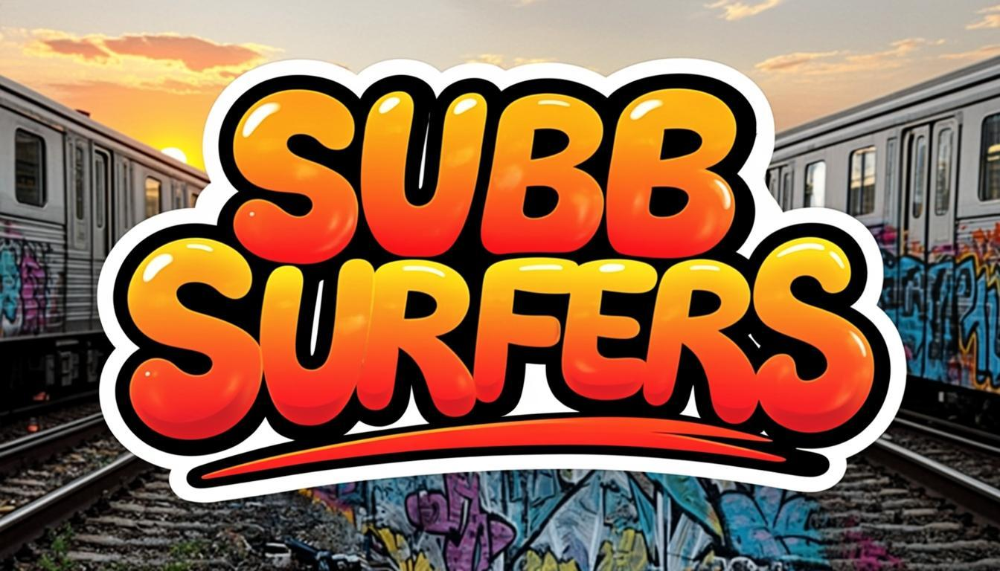
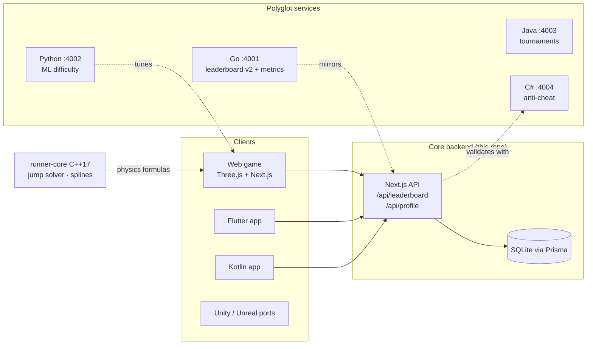

<p align="center">
  
</p>

<h1 align="center">SUBB SURFERS</h1>

<p align="center">
  <strong>A full-stack, polyglot 3D endless runner — web game, mobile apps, five backend
  services, two game-engine ports and complete CI/CD, in one monorepo.</strong>
</p>

<p align="center">
  <a href="#-quick-start">Quick start</a> ·
  <a href="#-the-game">The game</a> ·
  <a href="#-architecture">Architecture</a> ·
  <a href="#-repository-map">Repo map</a> ·
  <a href="#-api-contracts">API</a> ·
  <a href="#-ci-cd--mlops">CI/CD</a>
</p>

<p align="center">
  
</p>

> **Original IP notice** — SUBB SURFERS is an original homage to the endless-runner
> genre. All characters, art, code and audio are original and procedural; no assets
> or code from any commercial game are used.

---

## 🚀 Quick start

**The playable game** (Node 20+ & Bun):

```bash
bun install
bun run db:push          # create SQLite schema
bun prisma/seed.ts       # seed rival leaderboard entries
bun run dev              # → http://localhost:3000
```

That's the whole game. Everything else in the monorepo is optional infrastructure.

| Stack | Path | Run it |
|---|---|---|
| 🎮 Web game | `src/` | `bun run dev` |
| ⚡ Go service | `services/leaderboard-go` | `go run .` → `:4001` |
| 🐍 Python MLOps | `services/ml-python` | `uvicorn app.main:app --port 4002` |
| ☕ Java tournaments | `services/tournament-java` | `mvn spring-boot:run` → `:4003` |
| 🎯 C# anti-cheat | `services/anticheat-csharp` | `dotnet run` → `:4004` |
| ⚙️ C++ core | `native/runner-core` | `cmake -B build && cmake --build build` |
| 📱 Flutter app | `mobile/flutter_app` | `flutter create . --platforms android,ios && flutter run` |
| 🤖 Kotlin app | `mobile/android-native` | open in Android Studio |
| 🕹️ Unity port | `unity/subb-surfers-unity` | open with Unity 2022.3 LTS |
| 🎬 Unreal port | `unreal/subb-surfers-ue` | right-click `.uproject` → generate files |
| 🐳 Full stack | `infra/` | `docker compose -f infra/docker-compose.yml up` |

---

## 🎮 The game

Dodge oncoming trains, weave between barriers, ride train roofs and out-run the
Inspector and his dog — while chaining missions to multiply your score.

- **Movement** — Arrows / WASD / Space, or swipe & tap on touch screens
- **Jump** over blockades · **Roll** under hazard barriers · **Switch lanes** to thread trains
- **Power-ups** — 🧲 Coin Magnet · 🚀 Jetpack (sky coin trails) · ⚡ 2× Multiplier · 👟 Super Sneakers · 🛹 Hoverboard (absorbs one crash)
- **Missions** — every completed mission permanently raises your run multiplier (×5 cap, ×10 with a 2× pickup)
- **Train roofs are walkable** — risk/reward coin lines above the tracks
- **Global leaderboard** with server-side anti-cheat validation
- **Three original characters** with gameplay perks, unlocked with collected coins

### Engineering highlights

| Area | Detail |
|---|---|
| Zero asset downloads | Every texture is a runtime `CanvasTexture`; every sound is synthesized WebAudio; characters are procedural low-poly rigs with a hand-written animator. First load is milliseconds. |
| Deterministic feel | Physics constants (`gravity 38`, `jump v₀ 13.5`, lanes 2.2 m) are mirrored across the TS game, the C++ `runner-core` library, the Unity C# and Unreal C++ ports. |
| Fair play | Shared anti-cheat heuristic (identical constants in TS, Go and C#) rejects impossible scores server-side; runs start with a guaranteed 60 m safe runway. |
| Performance | Pooled coins/trains/obstacles, per-chunk geometry merging, capped pixel ratio, throttled React↔engine sync (12.5 Hz), ACES tone mapping, soft shadow frustum tracking. |

---

## 🏗 Architecture



- **Web game** is the flagship: a complete Three.js engine (scene streaming, pooled
  entities, AABB collision solver, power-up/mission state machines, procedural
  audio) wrapped by a Next.js + zustand + shadcn/ui meta-game.
- **Services** are independent, containerized, health-checked, and Prometheus-instrumented.
- **`runner-core`** (C++) documents the physics in executable form and is mirrored
  by the TypeScript implementation the web game actually runs.

## 🗺 Repository map

```
subb/
├── src/                        # 🎮 Flagship web game (Three.js engine + Next.js UI)
│   ├── game/                   #    Engine: config, world streaming, entities, player,
│   │   │                       #    audio, input, procedural rigs & textures
│   │   └── world/World.ts      #    Chunk streaming + fair-spawn level generator
│   ├── components/game/        #    Menu, HUD, pause, game-over, leaderboard UI
│   ├── app/api/                #    Leaderboard + profile route handlers
│   └── lib/                    #    zustand store, engine bridge, anti-cheat
├── prisma/                     # Schema + rival seed
├── services/
│   ├── leaderboard-go/         # ⚡ Go 1.23 · Gin · Prometheus · tests
│   ├── ml-python/              # 🐍 FastAPI · scikit-learn model + training pipeline
│   ├── tournament-java/        # ☕ Spring Boot 3 · Java 21 · scheduled lifecycles
│   └── anticheat-csharp/       # 🎯 .NET 8 minimal API · shared heuristic
├── native/runner-core/         # ⚙️ C++17 physics/spline lib + benchmark
├── mobile/
│   ├── flutter_app/            # 📱 Flutter 3.24 Material 3 client
│   └── android-native/         # 🤖 Kotlin 2.0 + Compose + Retrofit
├── unity/subb-surfers-unity/   # 🕹️ Unity 2022.3 C# source
├── unreal/subb-surfers-ue/     # 🎬 Unreal 5.4 C++ source
├── infra/                      # 🚀 compose · nginx · k8s · terraform · prometheus
└── .github/                    # CI (9 jobs) · CD · MLOps · dependabot · templates
```

## 🔌 API contracts

| Endpoint | Method | Purpose |
|---|---|---|
| `/api/leaderboard?limit=` | GET | Top players by best score |
| `/api/leaderboard` | POST | Submit a run `{name, score, coins, distance, missions, character}` → `{rank, best, personalBest}` (422 + reason when anti-cheat rejects) |
| `/api/profile?name=` | GET | Player bests, lifetime totals, last 5 runs |
| `:4001/api/v1/*` | Go | `scores`, `leaderboard`, `players/:name/stats`, `/metrics` |
| `:4002/api/v1/difficulty` | POST | Telemetry → adaptive difficulty parameters |
| `:4003/api/v1/tournaments/*` | REST | Create/join/score/leaderboard tournaments |
| `:4004/api/v1/validate` | POST | Score submission validation `{valid, reason, confidence}` |

## 🔄 CI/CD & MLOps

- **`ci.yml`** — 9 parallel jobs: web (bun+lint+tsc), Go, Python (pytest), C++
  (ubuntu+macOS), C#, Java, Flutter (APK artifact), Kotlin (Gradle), Unity (GameCI).
- **`cd.yml`** — on `v*` tags: builds & pushes 5 Docker images to GHCR; opt-in K8s deploy gate.
- **`mlops.yml`** — weekly cron retrains the difficulty model on synthetic telemetry
  and commits the new `difficulty_model.joblib` + `metrics.json` back to the repo;
  the FastAPI service hot-loads it on restart.
- **Monitoring** — Prometheus scrapes all services; Grafana provisioned in compose.

## 📜 License

[MIT](LICENSE) © faisukhan01
